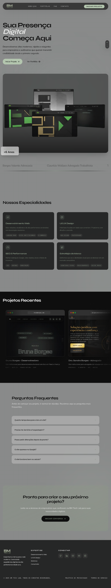

# BM Tech Lab - Structure

Check it here: [brunaborges.com/bmtechlab](https://brunaborges.com/bmtechlab)

### Preview

This repository contains the **architectural skeleton** of the BM Tech Lab digital studio. 

### What is this?
This is a dedicated reference for the technical structure of the studio. It shows how the components, theme, and layout are organized to create a high-performance digital presence.

### Key Highlights:
- **Component-Driven**: Small, reusable building blocks specialized for the studio's aesthetic.
- **Design Tokens**: Centralized theme management for consistency.
- **Next.js App Router**: Modern routing and layout structure.

> [!NOTE]
> This is a documentation and structural reference branch. The actual business logic and private assets are kept in a separate, private repository.

---
Created by [Bruna Borges](https://brunaborges.com)
